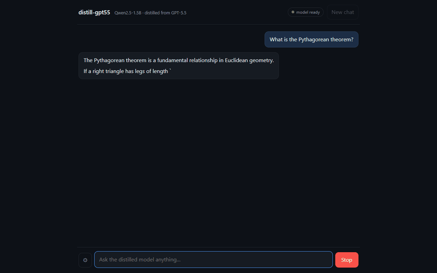
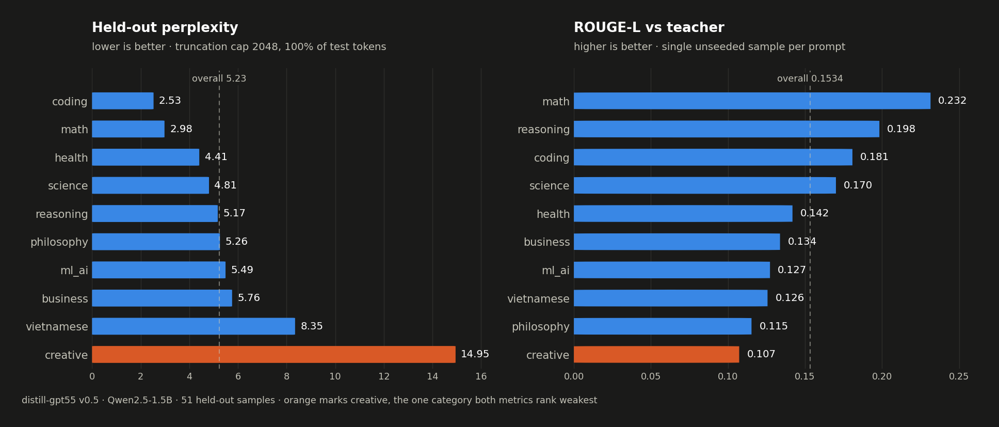

# distill-gpt55

> Chưng cất GPT-5.5-xhigh qua 9Router thành Qwen2.5-1.5B-Instruct, huấn luyện cục bộ trên RTX 3060 6GB, rồi phục vụ qua API tương thích OpenAI và web chat streaming.



<sub>Ảnh chụp thực tế: student 1.5B trả lời qua SSE từ llama.cpp chạy CPU, khoảng 1.4 token/giây; video được tăng tốc.</sub>

## Mục lục

- [Dự án này làm gì?](#dự-án-này-làm-gì)
- [Kết quả v0.5 & v0.6](#kết-quả-v05)
- [Kiến trúc](#kiến-trúc)
- [Chạy nhanh bằng Docker](#chạy-nhanh-bằng-docker)
- [Dùng web chat và lịch sử hội thoại](#dùng-web-chat-và-lịch-sử-hội-thoại)
- [Pipeline huấn luyện](#pipeline-huấn-luyện)
- [Kiểm thử](#kiểm-thử)
- [Tài liệu chi tiết](#tài-liệu-chi-tiết)

## Dự án này làm gì?

`distill-gpt55` có hai phần tách biệt:

| Phần | Mục đích | Khi nào cần chạy |
|---|---|---|
| **Offline training** | Sinh teacher outputs, lọc/split dataset, fine-tune LoRA, đánh giá, export GGUF | Khi tái tạo hoặc cải thiện model |
| **Online serving** | Phục vụ GGUF bằng FastAPI + llama.cpp và chat UI React | Khi muốn dùng model |

Bạn **không cần** 9Router, GPU, hay môi trường training để chạy bản GGUF đã export. Serving hiện chạy CPU trong API container.

## Kết quả v0.5

| Metric | v0.4 | **v0.5 hiện tại** |
|---|---:|---:|
| Held-out perplexity, cap 2048 | Chưa đo ở cap này | **5.23** |
| Held-out perplexity, cap 512 | 6.93 | **5.38** (giảm 22.4%) |
| Validation loss tốt nhất | Không có validation split | **1.409** |
| Dataset train / validation / test | 357 / 0 / 38 | **426 / 51 / 51** |
| Teacher outputs | 396 / 530 | **530 sinh, 528 giữ lại** |
| Chat template | Plain-text gần đúng | Qwen `<|im_start|>` chính xác |

Perplexity luôn đi kèm truncation cap. Test split có median 525 token: cap 512 chỉ chấm khoảng 70% token, còn cap 2048 chấm 100%. Chỉ so sánh các số đo ở **cùng cap**.



Tái tạo headline: `python -m distill.evaluate --label v0.5`. Báo cáo đầy đủ: [`plans/reports/evaluation-v0.5.md`](plans/reports/evaluation-v0.5.md).

### v0.6 — mở rộng category yếu (thử nghiệm, không ship)

v0.6 thêm 40 prompt cho `creative`/`vietnamese`/`reasoning` (3 category yếu nhất
của v0.5), sinh lại teacher outputs (570/568 accepted), re-split 460/54/54 và
retrain 3 epoch. **Kết quả hỗn hợp, không đạt mục tiêu:**

| Metric | v0.5 (canonical) | v0.6 (thử nghiệm) |
|---|---:|---:|
| Overall held-out PPL @cap 2048 | **5.23** | 5.85 (mục tiêu ≤ 5.23: ✗) |
| `creative` PPL | 14.95 | **14.21** ✓ |
| `vietnamese` PPL | 8.35 | **7.02** ✓ |
| `reasoning` PPL | 5.17 | **3.67** ✓ |
| `ml_ai` PPL | 5.49 | **4.17** ✓ |
| `science` PPL | 4.81 | 6.06 ✗ |
| `philosophy` PPL | 5.26 | 6.22 ✗ |
| LLM-as-judge | chưa chạy | chưa chạy |
| GGUF export | Q4_K_M + Q5_K_M | chưa export |

3 category mục tiêu **cải thiện**, nhưng `science`/`philosophy` **lùi** và
headline **tệ hơn** — một phần do test split đổi (51→54 mẫu, nhiều category PPL
cao hơn), một phần do mở rộng chỉ category yếu làm loãng category mạnh. **Serving
vẫn dùng v0.5 GGUF** (model tốt hơn overall). Báo cáo:
[`plans/reports/evaluation-v0.6.md`](plans/reports/evaluation-v0.6.md). Bài học
và kế hoạch v0.7: [`docs/project-roadmap.md`](docs/project-roadmap.md).


## Kiến trúc

```text
OFFLINE — RTX 3060 6GB                         ONLINE — docker compose
prompts.json (570)                             ┌────────────┐    REST / SSE   ┌──────────────┐
  → generate_dataset (9Router)                 │ web        │ ───────────────▶│ api          │
  → dataset (quality gate + split)             │ React/Vite │                  │ FastAPI      │
  → train (bf16 LoRA + validation)             │ nginx      │◀─────────────────│ llama.cpp CPU│
  → merge → evaluate → export_gguf             └────────────┘                  └──────┬───────┘
                                                                             GGUF /models (RO)
```

Chi tiết thành phần, contract và data flow: [`docs/system-architecture.md`](docs/system-architecture.md).

## Chạy nhanh bằng Docker

### Điều kiện cần

1. Docker Desktop với Compose v2.
2. File GGUF tại `checkpoints/gguf/distill-gpt55-v0.5-Q4_K_M.gguf`.

### Khởi động

```bash
docker compose up --build
```

| Dịch vụ | URL | Ghi chú |
|---|---|---|
| Web chat | http://localhost:3000 | Chỉ khởi động sau khi API ready |
| API | http://localhost:8000 | OpenAI-compatible |
| Readiness | http://localhost:8000/readyz | `503` trong lúc GGUF đang load |
| Liveness | http://localhost:8000/healthz | Process còn sống |

Xác minh API sau khi model load:

```bash
curl http://localhost:8000/readyz
curl http://localhost:8000/v1/chat/completions -H "Content-Type: application/json" \
  -d '{"messages":[{"role":"user","content":"What is 2+2?"}]}'
```

Nếu `/readyz` vẫn trả `503`, xem `docker compose logs api`; đừng kết luận service hỏng chỉ vì model đang cold-start. Hướng dẫn triển khai và rollback: [`docs/deployment-guide.md`](docs/deployment-guide.md).

## Dùng web chat và lịch sử hội thoại

Giao diện là một chat view với streaming SSE, markdown đã sanitize cho assistant output, tùy chọn generation và history local-first.

### Luồng sử dụng

1. Mở http://localhost:3000 và chờ badge hiện **model ready**.
2. Nhập câu hỏi; `Enter` gửi, `Shift+Enter` xuống dòng.
3. Dùng **New chat** hoặc sidebar để tạo/chuyển/xóa hội thoại.
4. Khi đang sinh, dùng **Stop** để abort request. Điều hướng history bị khóa trong thời gian này để token không ghi nhầm vào chat khác.

### Lịch sử được lưu ở đâu?

History chỉ lưu trong `localStorage` của **browser profile hiện tại**, dưới key `distill-gpt55.chat-history.v1`.

| Hành vi | Thực tế |
|---|---|
| Giới hạn | 30 conversations gần nhất; 100 completed messages/conversation |
| Tiêu đề | Tạo từ user prompt đầu tiên, gọn tối đa 48 ký tự |
| Dữ liệu không lưu | Assistant response rỗng, lỗi hoặc chưa hoàn tất |
| Khi storage lỗi/đầy | Chat hiện tại vẫn dùng được trong RAM; persistence bị bỏ qua |
| Sync / account / export / recovery | **Không có** |
| Khi xóa site data hoặc đổi browser/profile | History biến mất khỏi browser đó |

History trong UI được gửi lại làm context ở lượt kế tiếp, cùng với system prompt. Đây **không** phải bộ nhớ dài hạn: API mặc định có cửa sổ context 4096 token và hiện web không token-truncate history trước request. Giữ conversation ngắn nếu câu trả lời bắt đầu lỗi context hoặc kém liên quan.

Chi tiết UX, accessibility và quy ước UI: [`docs/design-guidelines.md`](docs/design-guidelines.md). Hướng dẫn frontend: [`services/web/README.md`](services/web/README.md).

## Pipeline huấn luyện

> Cần Python environment phù hợp, 9Router cho generation/judge và RTX 3060 6GB cho training theo cấu hình v0.5.

```bash
pip install -e .[train,dev]
set PYTHONPATH=src

python -m distill.download_student
python -m distill.generate_dataset
python -m distill.dataset
python -m distill.train
python -m distill.merge
python -m distill.evaluate --label v0.5
python -m distill.export_gguf
python -m distill.chat
```

Copy `.env.example` thành `.env` rồi điền API key trước khi gọi teacher. Với máy tương tự, v0.5 dùng `LOAD_IN_4BIT=false`, `GRADIENT_CHECKPOINTING=true`, `MAX_SEQ_LENGTH=512`: bitsandbytes 4-bit hiện lỗi trong Python 3.14 + torch nightly. Không commit `.env`.

## Kiểm thử

```bash
python -m pytest tests/ -q                    # training pipeline
cd services/api && python -m pytest tests/ -q # API, fake runtime, không cần model/GPU
cd services/web && pnpm test && pnpm build    # UI tests + typecheck + production build
ruff check src/ tests/ services/api/
```

API contract chuẩn là [`docs/openapi.yaml`](docs/openapi.yaml). Sau khi sửa API, regenerate frontend types rồi kiểm tra diff:

```bash
cd services/web
pnpm run generate-client
pnpm build
```

## Tài liệu chi tiết

| Tài liệu | Nội dung |
|---|---|
| [`docs/project-overview-pdr.md`](docs/project-overview-pdr.md) | Requirements, metric, constraint và risk sản phẩm |
| [`docs/system-architecture.md`](docs/system-architecture.md) | Kiến trúc offline/online và chat data flow |
| [`docs/deployment-guide.md`](docs/deployment-guide.md) | Docker, local run, smoke test, resource và rollback |
| [`docs/code-standards.md`](docs/code-standards.md) | Quy ước code, test, contract và training constraints |
| [`docs/design-guidelines.md`](docs/design-guidelines.md) | Design tokens, responsive/accessibility, state và history UX |
| [`docs/project-roadmap.md`](docs/project-roadmap.md) | Những phần đã hoàn thành, giới hạn đã biết và roadmap |
| [`services/api/README.md`](services/api/README.md) | API endpoints, config và runbook |
| [`services/web/README.md`](services/web/README.md) | Web setup, history behaviour và frontend troubleshooting |

## Repo layout

```text
src/distill/       Training pipeline package
services/api/      FastAPI + llama.cpp inference service
services/web/      React chat UI
data/              Prompts, teacher outputs, processed splits
checkpoints/       Adapter, merged model, GGUF artifacts (gitignored)
docs/              Architecture, deployment, standards, roadmap, OpenAPI
plans/             ClaudeKit plans và evaluation reports
```

## Known constraints

- **6GB VRAM:** v0.5 dùng bf16 LoRA + gradient checkpointing; sequence length training bị giới hạn 512.
- **Python 3.14:** cần torch nightly CUDA; load model CPU-first rồi mới đưa sang GPU để tránh crash đã biết.
- **9Router:** chỉ cần cho sinh dataset/judge, không cần khi serving.
- **Local deployment:** API serialize generation vì llama.cpp context không thread-safe; không phải multi-user scale-out service.

Xem các giới hạn, lý do và hướng xử lý tại [`docs/project-roadmap.md`](docs/project-roadmap.md).